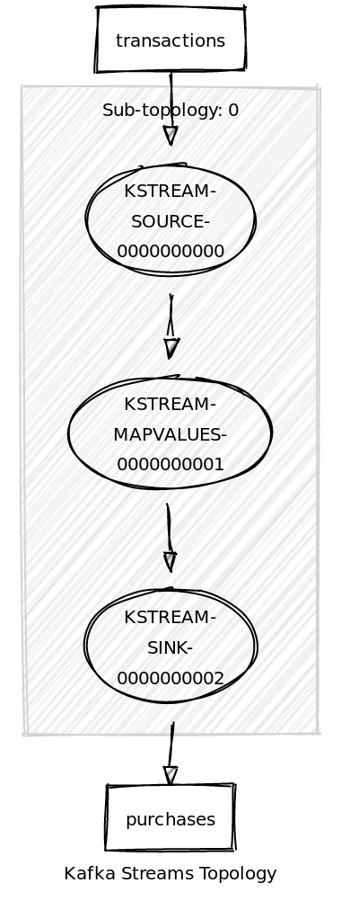
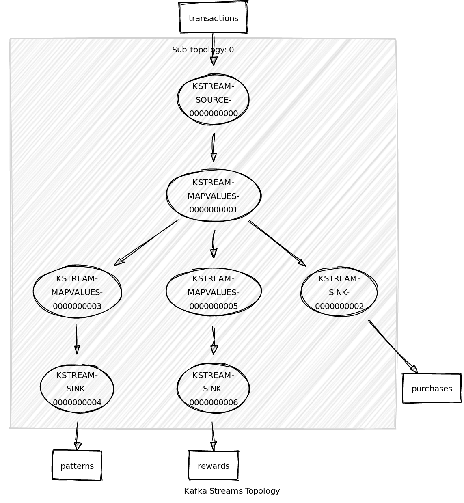

## Introduction

This is a repo with the source code of the Kafka Streams workshop. It's designed as an easy way to
use Kafka Streams with minimal setup and dependencies. We'll start implementing a fictional business scenario
and then adding new requirements step by step, from easy usage of Kafka Streams to more elaborated
functionality.

All the exercises will be explained during the workshop. If you are blocked, you can open the following exercise
to see the solution to the previous one. We encourage you to try do the exercises by yourself. It's the best way
to really learn Kafka Streams.

## In advance steps

In order to be ready for the workshop and avoid dependencies with the Internet connection, you can do the
following steps:

- Download the code in your laptop:

```
git clone https://github.com/antonmry/kafka-streams-workshop.git
```

- Execute one test (it should pass it):

Windows:
```
gradlew.bat test --tests KafkaStreamsIntegrationTest
```
Linux:
```
./gradlew test --tests KafkaStreamsIntegrationTest
```

- Import the project in your favourite IDE.

## Software Requirements

To get started you need to have installed following:

* [Java Development Kit 8](https://www.oracle.com/technetwork/java/javase/downloads/jdk8-downloads-2133151.html)

Project is built using [Gradle](https://gradle.org/) build tool but it’s using [Gradle Wrapper](https://docs.gradle.org/current/userguide/gradle_wrapper.html) 
so you are not required to install it manually nor you don’t have to be afraid of version clash.

You can use IDE of your choice but [IntelliJ IDEA](https://www.jetbrains.com/idea/) provides so far the best Gradle 
integration even in the free Community version. Import the project as Gradle project get the best developer experience.

Because of [RocksDB requirements](https://github.com/facebook/rocksdb/issues/2531) you may need to install
the [C++ 2015 redistributable](https://www.microsoft.com/en-us/download/details.aspx?id=48145).

## What are you going to do?

You have just been hired by a big retail company as Data Engineer. Ready for the challenge?.

Let's start with the first task!

### Exercise 0: reading, transforming and writing to Kafka

Security department has raised an issue because credit card numbers are being stored in different databases in the
company and that's a huge potential risk. Your first tasks is mitigate that problem. The easiest way is obfuscate 
the credit card number in the `purchase` topic when is copied from the `transaction` topic.  

You have a deadline in tree months and six-figures budget. Unfortunately, this workshop only last 2 hours so forget 
the budget and let's start coding.

0. Open `src/test/java/antonmry/exercise_0/KafkaStreamsIntegrationTest0.java` and investigate how an 
integration test is done with Kafka Streams and get familiarised with the test and the format of the
 of the messages.
1. Open `src/main/java/antonmry/exercise_0/KafkaStreamsApp0.java`
2. Complete with the proper code the places indicated with a TODO comment (except the homework).
3. Test it! We recommend to launch the test using your IDE instead of Gradle so you can do it easily but you can also
do it also from command line:

Windows:
```
gradlew.bat test --tests KafkaStreamsIntegrationTest0
```
Linux:
```
./gradlew test --tests KafkaStreamsIntegrationTest0
```

Done? Do you have time yet? Try with the homework: write some integration tests. See the 
[Kafka JUnit](https://github.com/salesforce/kafka-junit/tree/master/kafka-junit5). 

Topology: 



### Exercise 1: build a topology with several nodes

Wow! Your managers are quite surprised with how fast you solved the credit card numbers issue. They see the potential of
the Kafka platform and your skills and they want take advantage of both of them. More requirements are coming! 

- A new rewarding system is going to be deployed and it needs information about the purchases to determine the rewards.
It will read this information from a topic `rewards`. The customer earns a point per euro, and transaction totals are 
rounded down to the nearest euro. Fields `totalRewardPoints` and `daysFromLastPurchase` should be empty or with any 
value.
- Some important business people would like to be able to identify purchases patterns in real-time. A new service of 
reporting has been deployed but we need to feed it with the information. It will read from a topic `PurchasePattern`.

Next steps:

0. Open `src/test/java/antonmry/exercise_1/KafkaStreamsIntegrationTest1.java` and investigate how an 
integration test is done with Kafka Streams and get familiarised with the test and the format of the
 of the messages.
1. Open `src/main/java/antonmry/exercise_1/model/PurchasePattern.java` and complete with the proper code the places 
indicated with a TODO comment. 
2. Open `src/main/java/antonmry/exercise_1/model/RewardAccumulator.java` and complete with the proper code the places 
indicated with a TODO comment. 
3. Open `src/main/java/antonmry/exercise_1/KafkaStreamsApp1.java` and complete with the proper code the places indicated 
with a TODO comment (except the homework).
4. Test it! We recommend to launch the test using your IDE instead of Gradle so you can do it easily but you can also
do it also from command line:

Windows:
```
gradlew.bat test --tests KafkaStreamsIntegrationTest1
```
Linux:
```
./gradlew test --tests KafkaStreamsIntegrationTest1
```

Done? Do you have time yet? Try with the homework: improve performance changing from JSON to Avro serialization. 
See the [official documentation](https://docs.confluent.io/current/streams/developer-guide/datatypes.html#avro).

Topology: 



### Exercise 2: filtering, branching and adding keys

You rock and your managers know it now... more requirements are coming. Let's see if we can keep this level of 
productivity. Requirements:

- Because fragrances and shoes belongs to specific brands (modeled as departments), they need access their respective
purchases information in real-time.
- Business managers don't have interest in purchases smaller than 5.0 € and filter them seems a lot of work for them so 
they asked  you to do it.
-  A new team discovered the information you are making available and they started to using it for a cool new use case. 
But there is a problem: they need a key which it doesn't exist right now. Could you add it?

Next steps:

0. Open `src/test/java/antonmry/exercise_2/KafkaStreamsIntegrationTest2.java` and investigate how an 
integration test is done with Kafka Streams and get familiarised with the test and the format of the
 of the messages.
1. Open `src/main/java/antonmry/exercise_2/KafkaStreamsApp2.java` and complete with the proper code the places indicated 
with a TODO comment (except the homework).
2. Test it! We recommend to launch the test using your IDE instead of Gradle so you can do it easily but you can also
do it also from command line:

Windows:
```
gradlew.bat test --tests KafkaStreamsIntegrationTest2
```
Linux:
```
./gradlew test --tests KafkaStreamsIntegrationTest2
```

Done? Do you have time yet? Try with the homework: 
[setup Kafka in your local environment using Docker](https://hub.docker.com/r/spotify/kafka/), launch the Kstream of the
 first exercise (using the gradle task runExercise0) and ingest in Kafka using 
 [kafkcat](https://github.com/edenhill/kafkacat). 

Topology: 


### Exercise 3: state stores

You've delivered the previous requirements, everything is working well and nobody wakes up in the night because the
service isn't working properly. It isn't the same for the colleague who share desk with you. It seems the rewarding
system has some problems and it's generating a lot of problems. Basically they are aggregating the information from 
Kafka to calculate the field `totalRewardPoints` based in the previous purchases. The rate is quite high so the updates 
of the aggregated purchase generate a lot of blocking threads in the database.

You would like to help your colleague and you remember something called state stores in kafka. Let's discover if it could
make the process easier.

Next steps:

0. Open `src/test/java/antonmry/exercise_3/KafkaStreamsIntegrationTest3.java` and investigate how an integration test is done with Kafka Streams and get familiarised with the test and the format of the of the messages.
1. Edit `src/main/java/antonmry/exercise_3/partitioner/RewardsStreamPartitioner.java` to establish the partitions of the
state store.
2. Open `src/main/java/antonmry/exercise_3/transformer/PurchaseRewardTransformer.java` to add your aggregations.
3. Edit `src/main/java/antonmry/exercise_3/KafkaStreamsApp3.java` and complete with the proper code the places indicated 
with a TODO comment (except the homework).
4. Test it! We recommend to launch the test using your IDE instead of Gradle so you can do it easily but you can also
do it also from command line:

Windows:
```
gradlew.bat test --tests KafkaStreamsIntegrationTest3
```

Linux:
```
./gradlew test --tests KafkaStreamsIntegrationTest3
```

Done? Do you have time yet? Try with the homework: investigate what's the advantage of `transformValues` over
`transform` and configure the state store to have a change log stored in a topic. 

Topology: 


### Exercise 4: joins 

It seems you have become the hero of the office with the ability to add status to your Kafka streams and store
information for the long-term. Your skills have spread to other departments and now you spend your days in meetings
with internal customers asking for no-sense implementations in Kafka. Welcome to fame!

One of those requirements is quite special. They would like to identify customers who buy shoes and fragrances with
less of 20 minutes of difference. The marketing department is quite sure that type of customer is preparing for
something special and it should be quite easier to inform of new items which would be of high interest for them.

You think about this specific requirement: the purchases of fragrances and shoes are currently available in real-time
in their respective topics and you already know how to store state of your steams. It should be possible, righ?
Let's figure out how to do it!

Next steps:

0. Open `src/test/java/antonmry/exercise_4/KafkaStreamsIntegrationTest4.java` and investigate how an integration test is done with Kafka Streams and get familiarised with the test and the format of the of the messages.
2. Edit `src/main/java/antonmry/exercise_4/joiner/PurchaseJoiner.java` and complete the
TODO to combine both purchases.
1. Edit `src/main/java/antonmry/exercise_4/KafkaStreamsApp4.java` and complete with the proper code the places indicated 
with a TODO comment (except the homework).
2. Test it! We recommend to launch the test using your IDE instead of Gradle so you can do it easily but you can also
do it also from command line:

Windows:
```
gradlew.bat test --tests KafkaStreamsIntegrationTest4
```

Linux:
```
./gradlew test --tests KafkaStreamsIntegrationTest4
```

Done? Do you have time yet? Try with the homework:

0. How many state stores are created because of the join? Why?

1. Modify the window to keep the twenty minutes but having order so we make sure the
shoes purchase occurs at least 5 minutes (or less) after the fragrance purchase.

2. For the join window you are using the timestamp placed in the metadata when the
 event is added to the log but this isn't exactly the requirement. Adapt the code to
  use the purchaseDate inside the event. See the 
  [TimeExtractor official doc](https://kafka.apache.org/10/javadoc/org/apache/kafka/streams/processor/TimestampExtractor.html) 
  for more information.
 
Topology: 


### Exercise 5: ktable and queryable event stores

The security teams has approached you with a weird requirement. They want to have access
to the last purchase of each customer but they don't want you to store it outside of Kafka
to avoid the possibility of someone altering the information. They also want to access to that
information synchronously using a REST API. They seem to have a very strong opinion about their
requirements and they wouldn't accept a negative to their request.

Would you be able to implement something like this?  

Next steps:

0. Open `src/test/java/antonmry/exercise_5/KafkaStreamsIntegrationTest5.java` and investigate how the integration test is done with Kafka Streams and get familiarised with the test and the format of the of the messages.
1. Edit `src/main/java/antonmry/exercise_5/KafkaStreamsApp5.java` and complete with the proper code the places indicated 
with a TODO comment (except the homework).
2. Test it! We recommend to launch the test using your IDE instead of Gradle so you can do it easily but you can also
do it also from command line:

Windows:
```
gradlew.bat test --tests KafkaStreamsIntegrationTest5
```

Linux:
```
./gradlew test --tests KafkaStreamsIntegrationTest5
```

Done? Do you have time yet? Try with the homework: implement the real REST API using your favorite framework.

Topology: 


  
## Acknowledgements

This workshop content and source code has been heavily inspired by `Kafka Streams in Action`. If you really want to 
learn Kafka Streams we encourage you to buy [the book](https://www.manning.com/books/kafka-streams-in-action) and take 
a look to [the Github repo with the source code](https://github.com/bbejeck/kafka-streams-in-action).

## Agenda

- Introduction to Kafka     -     15 min
- Exercise 0: stream        -     15 min
- Exercise 1: topology      -     15 min
- Exercise 2: branch        -     15 min (1 hour)
- Exercise 3: state store   -     15 min
- Exercise 4: joins         -     15 min
- Exercise 5: ktable        -     15 min
- Summary (optional)        -     15 min (2 hours)


